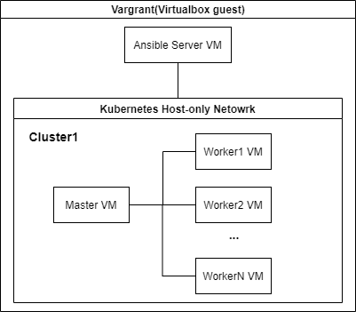

# 1. 개요
* 윈도우 환경에서 vagrant&Ansible을 이용하여 kubernetes설치
> 한계: IP를 수정하거나 워커노드를 수정하면 초기화 후 다시 실행


<br>아키텍처

<br>


<br>실행결과

<br>

# 2. 필요사양
> 현재 총 4개 VM이 기본 실행(ansible 서버, 쿠버네티스 마스터 노드 1개, 쿠버네티스 워커노드 2개)
## 2.1 권장사양
* 램: 16GB 이상
* CPU: 코어 4개 이상
* 저장장치 용량: 20GB이상

## 2.2 최소사양
> 쿠버네티스 마스터 노드 1개, 워커 노트 2개 이하 실행
* 램: 8GB 이상
* CPU: 코어 2개 이상
* 저장장치 용량: 10GB이상

<br>

# 3. 실행
> 실행환경: 윈도우 10
## 3.1 실행 전 설치 소프트웨어
* virtualbox
* vagrant

## 3.2 실행방법
```
vagrant up
```
## 3.3 실행과 관련된 문서
1. [vargrant 게스트 원격접속](documentation/vagrant_ssh원격접속.md)
2. [VM게스트 사양 등 설정](documentation/vagrant_게스트설정.md)
3. [IP수정, 워커노드 추가](documentation/마스터&워커노드_IP수정.md)
4. [kubelet ip 수정](documentation/kubelet_ip수정.md)
5. [helloworld 프로젝트 실행](documentation/helloworld.md)   

<br> node1, node2에 pod 생성확인

<br>

# 4. 참고자료
* [1] ansible와 vargrant로 kuberenes설치 공식문서: https://kubernetes.io/blog/2019/03/15/kubernetes-setup-using-ansible-and-vagrant/
* [2] vagrant+ansible 설치 블로그: https://daddyprogrammer.org/post/7369/ansible-vagrant/
* [3] ansible 스크립트 파일: https://gist.github.com/hi1280/69a76141450ff047764801a3d3db05b4
* [4] 우분투에 ansible 설치설명: https://dev-yakuza.github.io/ko/environment/install-ansible/
* [5] vargrant provision.file: https://www.vagrantup.com/docs/provisioning/file
* [6] vagrant network 설정: https://www.vagrantup.com/docs/providers/virtualbox/networking
* [7] kubelet ip수정: https://github.com/kubernetes/kubeadm/issues/203